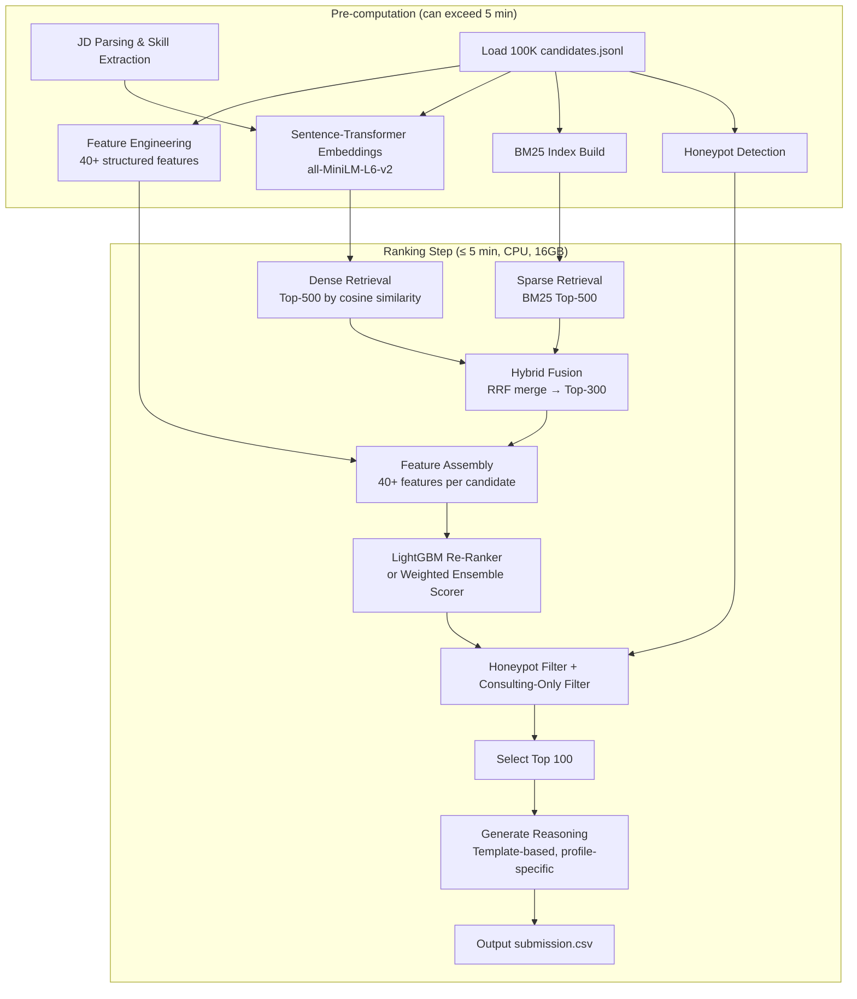

# RecruitX — Intelligent Candidate Discovery & Ranking Engine

## Implementation Plan for the Redrob Hackathon

### Problem Summary

Rank **100,000 candidates** against a specific **Senior AI Engineer JD** and produce a **top-100 CSV** with scores and per-candidate reasoning. The system is evaluated on:

- **NDCG@10 (50%)**, **NDCG@50 (30%)**, **MAP (15%)**, **P@10 (5%)**
- **Honeypot rate must be ≤10%** in top 100 (auto-disqualify otherwise)
- **Reasoning quality** (specific, honest, no hallucination, varied)
- **Compute constraints**: ≤5 min, 16GB RAM, CPU-only, no network during ranking

---

## Key Insights from JD Analysis

The JD is **not** a keyword-matching exercise. Critical signals from the JD:

1. **Must-have skills**: Embeddings-based retrieval (production), vector DB/hybrid search (production), strong Python, ranking evaluation frameworks (NDCG/MRR/MAP)
2. **Nice-to-have**: LLM fine-tuning (LoRA/QLoRA), learning-to-rank (XGBoost), HR-tech exposure, distributed systems, open-source contributions
3. **Explicit disqualifiers**: 
   - Entire career at consulting firms only (TCS, Infosys, Wipro, Accenture, Cognizant, Capgemini)
   - Pure CV/Speech/Robotics without NLP/IR
   - Pure researchers with no production deployment
   - "AI experience" = only recent LangChain/OpenAI usage
   - Title-chasers (switching every 1.5 years)
4. **Experience**: 5-9 years ideal, but flexible if signals strong
5. **Location**: India preferred (Pune/Noida/Hyderabad/Mumbai/Delhi NCR), flexible but no visa sponsorship
6. **Notice period**: Sub-30 days preferred, higher bar for 30+ days
7. **Behavioral signals matter**: Active candidates, good response rates, recent activity > perfect-on-paper but inactive

> [!IMPORTANT]
> The dataset contains **~80 honeypot candidates** with subtly impossible profiles (e.g., 8 years at a 3-year-old company, "expert" in 10 skills with 0 months usage). These must be detected and excluded.

> [!IMPORTANT]
> The JD explicitly warns: "The right answer is NOT find candidates whose skills section contains the most AI keywords." Keyword stuffers are traps built into the dataset.

---

## Proposed Architecture



---

## Proposed Changes

### Project Structure

```
d:\hackthons\RedRob\
├── src/
│   ├── __init__.py
│   ├── config.py              # All configuration, paths, weights
│   ├── jd_parser.py           # JD parsing and skill extraction
│   ├── candidate_loader.py    # Load and parse candidates.jsonl
│   ├── feature_engineer.py    # 40+ feature extraction per candidate
│   ├── honeypot_detector.py   # Detect impossible profiles
│   ├── text_builder.py        # Build searchable text from profiles
│   ├── embedder.py            # Sentence-transformer embedding
│   ├── bm25_retriever.py      # BM25 sparse retrieval
│   ├── hybrid_retriever.py    # RRF fusion of dense + sparse
│   ├── ranker.py              # Weighted ensemble / LightGBM scorer
│   ├── explainer.py           # Per-candidate reasoning generator
│   └── utils.py               # Shared utilities
├── precompute.py              # Pre-computation step (embeddings, features, index)
├── rank.py                    # Main ranking entry point (≤5 min)
├── app.py                     # Streamlit dashboard
├── requirements.txt
├── submission_metadata.yaml
├── README.md
└── data/                      # Symlink or path to dataset
    └── candidates.jsonl
```

---

### Component 1: JD Parser

#### [NEW] [config.py](file:///d:/hackthons/RedRob/src/config.py)

Central configuration with:
- JD extracted requirements (hardcoded after analysis — more reliable than runtime NLP for a single known JD)
- Must-have skills list, nice-to-have skills, disqualifier rules
- Scoring weights for each feature category
- File paths, model names, thresholds

#### [NEW] [jd_parser.py](file:///d:/hackthons/RedRob/src/jd_parser.py)

Since we have **one known JD**, we'll extract requirements as structured data at design time rather than relying on runtime NLP:

**Must-have skills** (with synonyms/aliases):
- Embeddings/retrieval: `sentence-transformers, BGE, E5, embeddings, vector search, semantic search, dense retrieval`
- Vector DBs: `FAISS, Qdrant, Pinecone, Weaviate, Milvus, OpenSearch, Elasticsearch`
- Python: `Python, python`
- Ranking/evaluation: `NDCG, MRR, MAP, ranking, learning-to-rank, A/B testing, evaluation`
- NLP/IR: `NLP, information retrieval, text mining, NER, text classification`

**Nice-to-have skills**:
- LLM fine-tuning: `LoRA, QLoRA, PEFT, fine-tuning`
- Learning-to-rank: `XGBoost, LightGBM, LambdaMART`
- HR-tech/marketplace experience
- Distributed systems
- Open-source contributions

**Disqualifier patterns**:
- Career entirely at consulting firms
- Pure CV/Speech/Robotics titles without NLP
- Very junior (< 2 years)

---

### Component 2: Feature Engineering

#### [NEW] [feature_engineer.py](file:///d:/hackthons/RedRob/src/feature_engineer.py)

Extract **40+ features** per candidate, grouped into:

**A. Skill-Match Features (highest weight)**
| Feature | Description |
|---------|-------------|
| `must_have_skill_count` | Count of JD must-have skills matched |
| `must_have_skill_ratio` | Ratio of must-have skills matched |
| `nice_to_have_skill_count` | Count of nice-to-have skills matched |
| `skill_proficiency_score` | Weighted sum of proficiency levels for matched skills |
| `skill_endorsement_score` | Sum of endorsements for matched skills |
| `skill_duration_score` | Sum of months for matched skills |
| `skill_assessment_avg` | Average assessment score for matched skills |
| `total_skill_count` | Total number of skills listed |
| `ai_ml_skill_depth` | Composite: count × proficiency × duration for AI/ML skills |
| `keyword_stuffer_flag` | High skill count but low duration/endorsements → trap signal |

**B. Career Features**
| Feature | Description |
|---------|-------------|
| `years_of_experience` | Direct from profile |
| `experience_in_band` | Boolean: 4-10 years range |
| `current_title_relevance` | Score based on title match (AI/ML Engineer > Software Engineer > Marketing Manager) |
| `career_title_relevance_max` | Max relevance across all career history titles |
| `product_company_experience` | Months at non-consulting product companies |
| `consulting_only_flag` | Career entirely at consulting firms (TCS/Infosys/Wipro/etc.) → disqualifier |
| `career_description_relevance` | Semantic similarity of career descriptions to JD key topics |
| `job_hop_score` | Average tenure at companies (penalize frequent switching) |
| `has_production_ml_signal` | Whether descriptions mention production, deployment, etc. |
| `current_company_size_score` | Preference for product-sized companies |

**C. Education Features**
| Feature | Description |
|---------|-------------|
| `education_relevance` | CS/ML/AI/Stats/Math field → high score |
| `education_tier` | tier_1 > tier_2 > tier_3 > tier_4 |
| `highest_degree_level` | PhD > MTech > BTech > BSc |

**D. Behavioral / Redrob Signal Features**
| Feature | Description |
|---------|-------------|
| `profile_completeness_score` | Direct from signals |
| `recency_days` | Days since last_active_date |
| `is_active_recently` | last_active within 90 days |
| `open_to_work_flag` | Boolean |
| `recruiter_response_rate` | Direct |
| `avg_response_time_score` | Inverse normalized response time |
| `interview_completion_rate` | Direct |
| `offer_acceptance_rate` | Direct (handle -1 as missing) |
| `github_activity_score` | Direct (handle -1 as missing) |
| `search_appearance_30d` | Recruiter search visibility |
| `saved_by_recruiters_30d` | Recruiter interest signal |
| `notice_period_score` | Lower is better (< 30 ideal, 30-60 okay, 60+ penalized) |
| `verified_signals` | email + phone + linkedin connected count |

**E. Location Features**
| Feature | Description |
|---------|-------------|
| `india_based` | Country == India |
| `preferred_city` | In Pune/Noida/Hyderabad/Mumbai/Delhi NCR |
| `willing_to_relocate` | Boolean |
| `work_mode_fit` | hybrid/flexible/onsite preferred |

---

### Component 3: Honeypot Detection

#### [NEW] [honeypot_detector.py](file:///d:/hackthons/RedRob/src/honeypot_detector.py)

Detect ~80 honeypots with impossible profiles:

1. **Experience impossibility**: Years of experience claimed vs career history timeline doesn't add up
2. **Skill duration impossibility**: "Expert" proficiency with 0-3 months duration
3. **Company timeline impossibility**: Duration at company exceeds company's known founding
4. **Skill count anomaly**: Very high number of expert skills with near-zero endorsements/duration
5. **Profile inconsistency**: Title says "Marketing Manager" but claims 15 expert AI skills
6. **Assessment score gap**: Claims "expert" proficiency but assessment scores are very low

Each check produces a `honeypot_score` (0-1). Candidates with score > threshold are flagged and excluded from top 100.

---

### Component 4: Text Building & Embeddings

#### [NEW] [text_builder.py](file:///d:/hackthons/RedRob/src/text_builder.py)

Build rich searchable text per candidate by concatenating:
- Headline + summary
- Career titles and descriptions
- Skill names (weighted by proficiency)
- Education fields
- Certifications

#### [NEW] [embedder.py](file:///d:/hackthons/RedRob/src/embedder.py)

- Model: `all-MiniLM-L6-v2` (fast, 384-dim, excellent for semantic similarity)
- Pre-compute embeddings for all 100K candidates (offline step)
- Embed JD requirements text
- Cosine similarity for dense retrieval

---

### Component 5: Hybrid Retrieval

#### [NEW] [bm25_retriever.py](file:///d:/hackthons/RedRob/src/bm25_retriever.py)

- Use `rank_bm25` library for sparse keyword retrieval
- Build BM25 index over candidate text representations
- Retrieve top-500 by BM25 score

#### [NEW] [hybrid_retriever.py](file:///d:/hackthons/RedRob/src/hybrid_retriever.py)

- **Reciprocal Rank Fusion (RRF)** to merge dense and sparse results
- Formula: `RRF_score = Σ 1/(k + rank_i)` where k=60
- Produce top-300 candidates for re-ranking

---

### Component 6: Re-Ranking

#### [NEW] [ranker.py](file:///d:/hackthons/RedRob/src/ranker.py)

**Primary approach: Weighted Ensemble Scorer**

Since we don't have labeled training data for a supervised LightGBM model, we'll use a carefully tuned weighted scoring system:

```
final_score = (
    0.35 × skill_match_score     # Must-have + nice-to-have skill alignment
  + 0.20 × career_relevance      # Title, description similarity, production ML
  + 0.15 × semantic_similarity   # Dense embedding cosine similarity
  + 0.10 × behavioral_score      # Redrob signals (activity, response rate, etc.)
  + 0.08 × experience_fit        # Years in range, not too junior/senior
  + 0.05 × education_quality     # Degree field, tier
  + 0.05 × location_fit          # India, preferred cities, relocation
  + 0.02 × disqualifier_penalty  # Consulting-only, keyword stuffer, etc.
)
```

Each component is normalized to [0, 1] before weighting.

**Penalty multipliers** (applied post-scoring):
- Honeypot detected → score × 0.0
- Consulting-only career → score × 0.3
- Keyword stuffer pattern → score × 0.4
- No ML/AI career signals at all → score × 0.5
- Inactive > 6 months → score × 0.7

> [!NOTE]
> If time allows, we can train a **LightGBM ranker** using the weighted scorer's output as pseudo-labels on a held-out set, creating a self-training loop that may discover better feature interactions. But the weighted ensemble is our production fallback.

---

### Component 7: Explainability / Reasoning

#### [NEW] [explainer.py](file:///d:/hackthons/RedRob/src/explainer.py)

Generate **specific, honest, varied** reasoning per candidate:

Template approach with profile-specific fact injection:

```
"{title} at {company} with {years} yrs experience.
 Strengths: {matched_skills}; {career_highlights}.
 Concerns: {missing_skills}; {concerns}."
```

Key rules:
- Reference **actual** skills from profile (no hallucination)
- Mention specific gaps honestly
- Vary language across candidates
- Connect back to JD requirements
- Match tone to rank (top-10 = positive with minor concerns, rank 80+ = significant gaps)

---

### Component 8: Streamlit Dashboard

#### [NEW] [app.py](file:///d:/hackthons/RedRob/app.py)

A visually polished recruiter dashboard:

1. **JD Display Panel** — Show parsed requirements
2. **Ranking Table** — Top-100 with rank, score, candidate summary
3. **Candidate Detail Card** — Expand to see full profile, career, skills
4. **Explainability Panel** — Why this rank? Skill match breakdown, concerns
5. **Skill Radar Chart** — Compare candidate's skills vs JD requirements
6. **Score Breakdown Bar Chart** — Show contribution of each scoring component
7. **Behavioral Signals Gauge** — Activity, responsiveness, verification status
8. **Comparison Mode** — Side-by-side compare 2-3 candidates
9. **Filter Controls** — Filter by location, experience range, work mode

---

### Component 9: Entry Points

#### [NEW] [precompute.py](file:///d:/hackthons/RedRob/precompute.py)

Pre-computation script (runs once, can take longer than 5 min):
1. Load all candidates
2. Extract features for all 100K
3. Compute sentence-transformer embeddings for all 100K
4. Build BM25 index
5. Run honeypot detection
6. Save pre-computed artifacts to `data/precomputed/`

#### [NEW] [rank.py](file:///d:/hackthons/RedRob/rank.py)

Main ranking entry point (must complete in ≤5 min):
```
python rank.py --candidates ./candidates.jsonl --out ./submission.csv
```

1. Load pre-computed artifacts (or compute on-the-fly if not available)
2. Run hybrid retrieval → top 300
3. Assemble features for shortlist
4. Run weighted ensemble scorer
5. Apply honeypot filter
6. Select top 100
7. Generate reasoning
8. Write CSV

---

## Open Questions

> [!IMPORTANT]
> **Q1: Do you want the GitHub repos cloned?** The listed repos (Haystack, Sentence Transformers, spaCy, etc.) are reference material. I'll use their *concepts* (sentence-transformers embedding, BM25 ranking, SHAP explanations) through pip-installable libraries rather than cloning the repos. This keeps the project clean and manageable. **Should I proceed this way, or do you want them cloned locally?**

> [!IMPORTANT]
> **Q2: Pre-computation approach.** Embedding 100K candidates with `all-MiniLM-L6-v2` on CPU takes ~15-30 minutes. The hackathon rules allow pre-computation to exceed 5 minutes, only the final ranking step must be under 5 minutes. **Is this acceptable?**

> [!IMPORTANT]
> **Q3: Streamlit vs Next.js for UI.** The submission requires a working sandbox (HuggingFace Spaces or Streamlit Cloud). **Streamlit is far faster to build and deploy for the hackathon. Shall I go with Streamlit, or do you prefer a Next.js + FastAPI full-stack approach?**

> [!IMPORTANT]
> **Q4: Python version.** I see you have Python 3.14 installed. Some ML libraries (sentence-transformers, scikit-learn) may not yet have wheels for 3.14. **Do you have Python 3.11 or 3.12 available, or should I use a virtual environment?**

---

## Verification Plan

### Automated Tests
```bash
# Validate submission format
python validate_submission.py submission.csv

# Check honeypot rate
python -c "import check_honeypots; check_honeypots.verify('submission.csv')"

# Verify runtime constraint
time python rank.py --candidates ./candidates.jsonl --out ./submission.csv
# Must complete in < 5 minutes
```

### Manual Verification
1. **Spot-check top 10**: Verify candidates are genuinely relevant AI/ML engineers, not keyword stuffers or marketing managers
2. **Honeypot check**: Verify no honeypots in top 100
3. **Reasoning quality**: Read 10 random reasoning entries — should be specific, varied, honest
4. **Score distribution**: Verify scores are monotonically non-increasing by rank
5. **Run Streamlit app**: Verify dashboard displays correctly with real data
6. **Sandbox test**: Deploy to Streamlit Cloud / HuggingFace Spaces and verify it works with sample data

---

## Implementation Priority Order

1. **Config + JD Parser** — Define the requirements structure
2. **Candidate Loader** — Load and parse 100K candidates efficiently
3. **Feature Engineer** — Extract all 40+ features
4. **Honeypot Detector** — Critical to avoid disqualification
5. **Text Builder + Embedder** — Semantic search foundation
6. **BM25 + Hybrid Retrieval** — Candidate shortlisting
7. **Ranker** — Weighted ensemble scoring
8. **Explainer** — Reasoning generation
9. **rank.py** — Main entry point, end-to-end pipeline
10. **Validation** — Test against constraints
11. **Streamlit Dashboard** — Recruiter UI
12. **Polish + Submission** — README, metadata, sandbox

---

## Dependencies

```
sentence-transformers>=2.2.0
numpy>=1.24.0
pandas>=2.0.0
scikit-learn>=1.3.0
rank-bm25>=0.2.2
streamlit>=1.28.0
plotly>=5.18.0
pyyaml>=6.0
tqdm>=4.66.0
```
